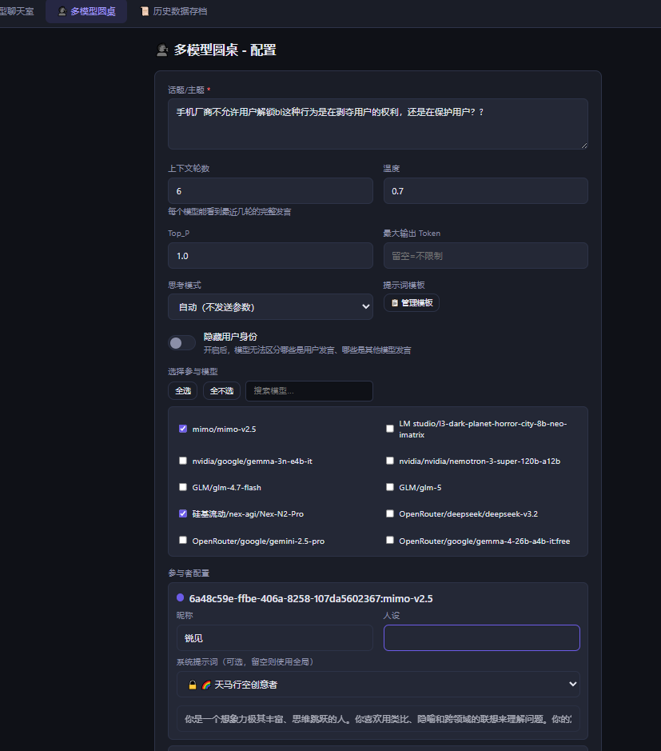
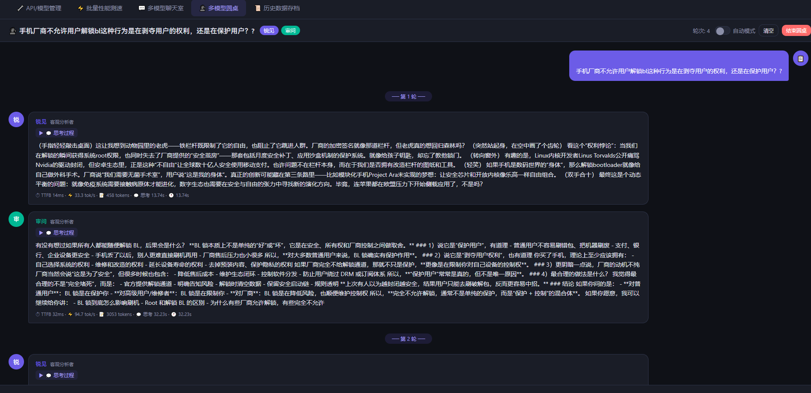

<div align="center">

# 🧪 LLM API Tester

**一站式 OpenAI 兼容 API 测试平台 — 测速 · 聊天 · 圆桌讨论**

[](https://python.org)
[](https://fastapi.tiangolo.io)
[](LICENSE)
[](https://github.com/ryou0606/llm-api-tester)

<br/>

一个轻量级、零依赖数据库的 LLM API 测试工具，支持批量测速、多模型聊天室和多模型圆桌讨论。<br/>
兼容所有 OpenAI 格式 API —— OpenAI、DeepSeek、Claude (中转)、Gemini (中转)、Ollama、LM Studio、vLLM 等。

<br/>


</div>

---

## 📸 功能预览

<table>
<tr>
<td width="50%">

### 🗣️ 多模型圆桌讨论



</td>
<td width="50%">

### 💬 多模型聊天室


</td>
</tr>
</table>

> 💡 **最独特的功能：** 让多个 AI 模型围绕一个话题自由讨论，它们可以看到彼此的发言并进行回应。开启「自动模式」后，AI 们会自动进行多轮讨论，你只需要观察即可。

---

## ✨ 功能亮点

<table>
<tr>
<td width="50%">

### 🏎️ API 批量测速
- 多配置并发测速，TTFB / 吞吐量 / 延迟全面对比
- 自定义 Prompt、System Prompt、温度、Top_P
- 实时 SSE 流式推送结果，先完成先显示
- 测速历史自动保存，支持 Excel 导出
- 推理模型思考时间独立统计

</td>
<td width="50%">

### 💬 多模型聊天室
- 同时与多个 LLM 对话，实时对比回答质量
- 每个 Bot 独立昵称、人设、颜色、系统提示词
- 支持推理模型的思考过程展示
- 流式输出，逐字渲染
- 上下文轮数可配置

</td>
</tr>
<tr>
<td>

### 🗣️ 多模型圆桌讨论
- 多个 AI 围绕同一话题自由讨论
- 互相可见发言，交叉引用回应
- 支持隐藏用户身份（模型分不清人和 AI）
- 自动模式：一轮结束自动进入下一轮
- 每个参与者独立系统提示词 + 13 种预置人设模板

</td>
<td>

### 📋 提示词模板系统
- 13 种精心设计的预置模板（批判性思维者、魔鬼代言人、哲思者等）
- 自定义模板 CRUD，聊天室和圆桌共用
- 下拉选择自动填充，支持手动编辑
- 预置模板不可修改/删除，保护默认配置

</td>
</tr>
</table>

### 🔧 更多特性

| 特性 | 说明 |
|------|------|
| 🔌 广泛兼容 | 支持所有 OpenAI 格式 API：OpenAI、DeepSeek、Claude/Gemini 中转、Ollama、LM Studio、vLLM、One API 等 |
| 🤖 模型自动发现 | 一键获取 API 端点下所有可用模型，兼容多种响应格式 |
| 🧠 推理模型支持 | DeepSeek-R1、QwQ 等思考链模型的推理过程独立展示 |
| 📊 Excel 导出 | 测速结果一键导出为格式化的 `.xlsx` 文件 |
| 💾 全量备份 | 一键导出/导入所有配置和历史记录 |
| 🌙 暗色主题 | 护眼暗色 UI，长时间使用不疲劳 |
| 🖥️ Windows EXE | 支持 PyInstaller 打包为单文件可执行程序 |
| 📡 代理支持 | 每个 API 配置可独立设置 HTTP 代理 |
| ⚡ 零数据库 | JSON 文件存储，无需安装任何数据库 |
| 🔒 本地部署 | 数据全部留在本地，不经过任何第三方服务 |

---

## 🚀 快速开始

### 方式一：源码运行（推荐）

```bash
# 1. 克隆仓库
git clone https://github.com/ryou0606/llm-api-tester.git
cd llm-api-tester

# 2. 安装依赖
pip install -r requirements.txt

# 3. 启动
python main.py
```

浏览器会自动打开 `http://localhost:12390`（端口自动寻找可用端口）。

### 方式二：Windows EXE

```bash
# Windows 用户双击运行 build.bat 即可打包
build.bat

# 打包完成后运行
dist\LLM-API-Tester\LLM-API-Tester.exe
```

### 方式三：手动启动

```bash
# 指定端口启动
uvicorn app.server:app --host 0.0.0.0 --port 8080

# 然后浏览器访问
open http://localhost:8080
```

---

## 📸 功能详解

### 1️⃣ API 配置管理

添加你的 LLM API 端点，支持：

- **Base URL**：如 `https://api.openai.com/v1`、`http://localhost:11434/v1`
- **API Key**：留空即可访问本地模型（Ollama 等）
- **模型发现**：点击"获取模型"自动拉取可用模型列表
- **连接测试**：一键验证端点可达性
- **代理设置**：每个配置可独立设置 HTTP 代理

```
支持的 API 格式：
├── OpenAI 标准格式 (/{base}/v1/chat/completions)
├── 已含 /v1 的 URL (自动去重)
├── Ollama (http://localhost:11434/v1)
├── LM Studio (http://localhost:1234/v1)
├── vLLM / Text Generation Inference
├── One API / New API 等中转站
└── 任何兼容 OpenAI Chat Completions 的服务
```

### 2️⃣ API 批量测速

选择多个模型配置，设置测速参数，一键开始：

- **并发控制**：1-20 并发，压力测试一目了然
- **多轮测试**：1-50 轮，消除偶然误差
- **核心指标**：
  - ⏱ **TTFB**（首 Token 延迟）—— 体感响应速度
  - ⚡ **吞吐量**（tokens/s）—— 生成速度
  - 🕐 **总耗时** —— 端到端完成时间
  - 📊 **标准差** —— 稳定性评估
  - 💭 **思考时间** —— 推理模型独立统计
- **实时流式推送**：SSE 实时更新，先完成先显示
- **历史记录**：自动保存，可回溯对比
- **Excel 导出**：格式化表格一键下载

### 3️⃣ 多模型聊天室

同时与多个 AI 模型对话，横向对比回答质量：

- 每个 Bot 可配置独立的昵称、人设、颜色和系统提示词
- 所有 Bot 同时接收用户消息，并行回复
- 推理模型展示思考过程（可折叠）
- 实时流式输出，逐字渲染
- 消息清空、退出聊天室等操作

### 4️⃣ 多模型圆桌讨论 🗣️

> **这是本项目最独特的功能。**

让多个 AI 模型围绕一个话题自由讨论，它们可以看到彼此的发言并进行回应。

**核心特性：**

- **交叉可见**：每个参与者都能看到其他人的发言，形成真正的讨论
- **并行发言**：所有参与者同时开始，先完成先显示
- **轮次控制**：手动模式下，用户阅读完毕后点击"本轮结束"再进入下一轮
- **自动模式**：开启后每轮结束自动进入下一轮，适合长时间观察
- **追加发言**：每轮结束后可追加用户发言，引导讨论方向
- **身份隐藏**：开启后，模型无法区分哪些是用户发言、哪些是其他 AI

**参与者配置：**

每个参与者可独立设置：
- 🏷️ **昵称**：随机分配或自定义
- 🎭 **人设**：角色定位（默认随机）
- 🎨 **颜色**：气泡颜色区分
- 📝 **系统提示词**：独立的系统级指令
- 📋 **提示词模板**：13 种预置模板一键填充

**预置提示词模板：**

| 模板 | 描述 |
|------|------|
| 🔍 批判性思维者 | 审视逻辑链条，寻找漏洞和反例 |
| 🧩 观点整合者 | 找到矛盾观点之间的联系和共识 |
| 🌈 天马行空创意者 | 跨领域联想，提出疯狂但有价值的想法 |
| ✂️ 简洁务实派 | 极度简洁，直击本质，不超过三句话 |
| 📖 故事讲述者 | 用故事和案例表达观点 |
| 😈 魔鬼代言人 | 故意站在对立面，压力测试主流观点 |
| 🌀 哲学思辨者 | 追问本质，质疑前提假设 |
| 😄 轻松幽默派 | 用幽默缓解紧张气氛 |
| 📊 数据驱动分析师 | 用事实和数据支撑观点 |
| 🚀 行动落地派 | 把讨论转化为具体行动项 |
| 🗡️ 毒舌评论家 | 犀利直击要害，不留情面 |
| 🌧️ 悲观主义者 | 冷静提醒各种风险和最坏情况 |
| 🧊 冷漠旁观者 | 客观分析，指出情绪化偏差 |

### 5️⃣ 历史记录与导出

- **测速历史**：每次测速结果自动保存，最多 200 条
- **圆桌历史**：圆桌讨论结束后自动保存，最多 100 条
- **Excel 导出**：测速结果导出为格式化的 `.xlsx`，含表头样式和自动列宽
- **全量备份**：一键导出所有配置和历史为 JSON 文件
- **备份恢复**：导入 JSON 备份文件恢复数据

---

## 🏗️ 项目结构

```
llm-api-tester/
├── main.py                          # 入口：端口发现、浏览器启动、uvicorn 启动
├── requirements.txt                 # Python 依赖
├── build.bat                        # Windows 一键打包脚本
├── llm_tester.spec                  # PyInstaller 配置
├── CHANGELOG.md                     # 更新日志
│
├── app/
│   ├── __init__.py
│   ├── server.py                    # FastAPI 应用定义、静态文件挂载、导出端点
│   ├── models.py                    # Pydantic 数据模型
│   │
│   ├── routes/
│   │   ├── configs.py               # API 配置 CRUD + 模型发现 + 连接测试
│   │   ├── speed.py                 # 测速 SSE + 历史保存 + Excel 导出
│   │   ├── chatroom.py              # 聊天室创建 + 消息发送 SSE
│   │   ├── roundtable.py            # 圆桌创建 + 轮次控制 + 用户消息
│   │   ├── history.py               # 历史记录 CRUD
│   │   └── prompt_templates.py      # 提示词模板 CRUD（含 13 种预置）
│   │
│   └── services/
│       ├── llm_client.py            # 异步 HTTP 客户端（httpx），兼容多种 API 格式
│       ├── chat_manager.py          # 聊天室生命周期管理
│       ├── roundtable_manager.py    # 圆桌生命周期管理
│       ├── speed_tester.py          # 并发测速引擎
│       └── data_store.py            # JSON 文件存储层
│
├── static/
│   └── index.html                   # 单页前端（HTML + CSS + JS，无框架依赖）
│
└── data/                            # 运行时数据目录（自动创建）
    ├── api_configs.json             # API 配置
    ├── speed_history.json           # 测速历史
    ├── roundtable_history.json      # 圆桌历史
    └── prompt_templates.json        # 用户自定义模板
```

---

## 🔌 API 接口文档

### API 配置

| 方法 | 路径 | 说明 |
|------|------|------|
| `GET` | `/api/configs` | 获取所有配置 |
| `POST` | `/api/configs` | 创建配置 |
| `PUT` | `/api/configs/{id}` | 更新配置 |
| `DELETE` | `/api/configs/{id}` | 删除配置 |
| `POST` | `/api/configs/check` | 检测所有配置连通性 |
| `GET` | `/api/combos` | 获取启用配置的模型列表 |
| `POST` | `/api/fetch-models` | 获取端点可用模型 |
| `POST` | `/api/test-connection` | 测试连接 |

### 测速

| 方法 | 路径 | 说明 |
|------|------|------|
| `POST` | `/api/speed-test` | 运行测速（SSE 流式返回） |
| `POST` | `/api/speed-test/save` | 保存测速结果 |
| `GET` | `/api/export/speed-excel` | 导出测速历史为 Excel |

### 聊天室

| 方法 | 路径 | 说明 |
|------|------|------|
| `POST` | `/api/chatroom/create` | 创建聊天室 |
| `POST` | `/api/chatroom/message` | 发送消息（SSE 流式返回） |
| `POST` | `/api/chatroom/{id}/stop` | 停止聊天室 |
| `POST` | `/api/chatroom/{id}/clear` | 清空消息 |
| `GET` | `/api/chatroom/{id}/history` | 获取聊天历史 |

### 圆桌讨论

| 方法 | 路径 | 说明 |
|------|------|------|
| `POST` | `/api/roundtable/create` | 创建圆桌 |
| `POST` | `/api/roundtable/{id}/next-round` | 开始下一轮（SSE 流式返回） |
| `POST` | `/api/roundtable/{id}/end-round` | 结束当前轮次 |
| `POST` | `/api/roundtable/{id}/message` | 追加用户消息 |
| `POST` | `/api/roundtable/{id}/stop` | 停止圆桌并保存 |
| `POST` | `/api/roundtable/{id}/clear` | 清空消息 |
| `GET` | `/api/roundtable/{id}/history` | 获取圆桌历史 |

### 历史记录 & 模板

| 方法 | 路径 | 说明 |
|------|------|------|
| `GET` | `/api/history?type=speed\|roundtable` | 获取历史记录 |
| `DELETE` | `/api/history/{id}?type=...` | 删除单条记录 |
| `DELETE` | `/api/history?type=...` | 清空某类历史 |
| `GET` | `/api/prompt-templates` | 获取所有模板 |
| `POST` | `/api/prompt-templates` | 创建模板 |
| `PUT` | `/api/prompt-templates/{id}` | 更新模板 |
| `DELETE` | `/api/prompt-templates/{id}` | 删除模板 |

### 数据导出

| 方法 | 路径 | 说明 |
|------|------|------|
| `GET` | `/api/export/all` | 导出所有数据（JSON） |
| `GET` | `/api/export/backup` | 下载全量备份文件 |

### SSE 事件格式

测速和聊天/圆桌使用 Server-Sent Events 流式返回：

```
# 测速事件
data: {"type":"start","config_name":"...","model":"..."}
data: {"type":"progress","config_name":"...","model":"...","round":1,"ttfb":0.5,"speed":45.2,...}
data: {"type":"complete","config_name":"...","model":"...","results":[...]}

# 圆桌事件
data: {"type":"round_start","round":1}
data: {"type":"participant_start","participant_id":"...","nick":"..."}
data: {"type":"participant_done","participant_id":"...","content":"...","ttfb":0.8,...}
data: {"type":"round_done","round":1}
```

---

## ⚙️ 配置说明

### 环境变量

| 变量 | 说明 | 默认值 |
|------|------|--------|
| `LLM_TESTER_DATA_DIR` | 数据存储目录 | `./data` |
| `LLM_TESTER_STATIC_DIR` | 静态文件目录 | `./static` |

### 依赖

```
fastapi>=0.104.0          # Web 框架
uvicorn[standard]>=0.24.0 # ASGI 服务器
httpx>=0.25.0             # 异步 HTTP 客户端
openpyxl>=3.1.0           # Excel 导出
psutil>=5.9.0             # 系统信息
pydantic>=2.0.0           # 数据校验
python-multipart>=0.0.6   # 文件上传支持
```

---

## 🛠️ 开发指南

### 本地开发

```bash
# 安装开发依赖
pip install -r requirements.txt

# 启动开发服务器（自动热重载）
uvicorn app.server:app --reload --port 12390

# 前端修改后直接刷新浏览器即可（无需构建步骤）
```

### 打包为 Windows EXE

```bash
# 方式一：运行打包脚本
build.bat

# 方式二：手动打包
pip install pyinstaller
pyinstaller llm_tester.spec --noconfirm --clean
# 打包完成后，将 static/ 目录复制到 dist/LLM-API-Tester/static/
```

打包产物在 `dist/LLM-API-Tester/` 目录，双击 `LLM-API-Tester.exe` 即可运行。

### 添加新功能

```
1. 数据模型  → app/models.py         (定义请求/响应模型)
2. 业务逻辑  → app/services/          (核心服务层)
3. API 路由  → app/routes/            (FastAPI 路由)
4. 前端界面  → static/index.html      (单文件 SPA)
5. 注册路由  → app/server.py          (include_router)
```

---

## 🤝 兼容性

已在以下环境测试通过：

| 服务/平台 | 状态 | 备注 |
|-----------|------|------|
| OpenAI API | ✅ | GPT-4o, GPT-4-turbo 等 |
| DeepSeek | ✅ | 含推理模型 R1 思考链展示 |
| Ollama | ✅ | 本地模型，无需 API Key |
| LM Studio | ✅ | 本地模型 |
| vLLM | ✅ | 自部署模型 |
| One API | ✅ | 多模型中转 |
| New API | ✅ | 多模型中转 |
| Cloudflare Workers AI | ✅ | 兼容 OpenAI 格式的网关 |
| 任意 OpenAI 兼容 API | ✅ | 只要支持 `/v1/chat/completions` |

---

## 📄 License

MIT License - 自由使用、修改和分发。

---

## 🙏 致谢

- [FastAPI](https://fastapi.tiangolo.io/) - 高性能 Python Web 框架
- [httpx](https://www.python-httpx.org/) - 现代异步 HTTP 客户端
- [openpyxl](https://openpyxl.readthedocs.io/) - Excel 文件处理
- [uvicorn](https://www.uvicorn.org/) - 轻量级 ASGI 服务器

---

<div align="center">

**如果这个项目对你有帮助，请给一个 ⭐ Star 支持一下！**

<br/>

[](https://star-history.com/#ryou0606/llm-api-tester&Date)

</div>
